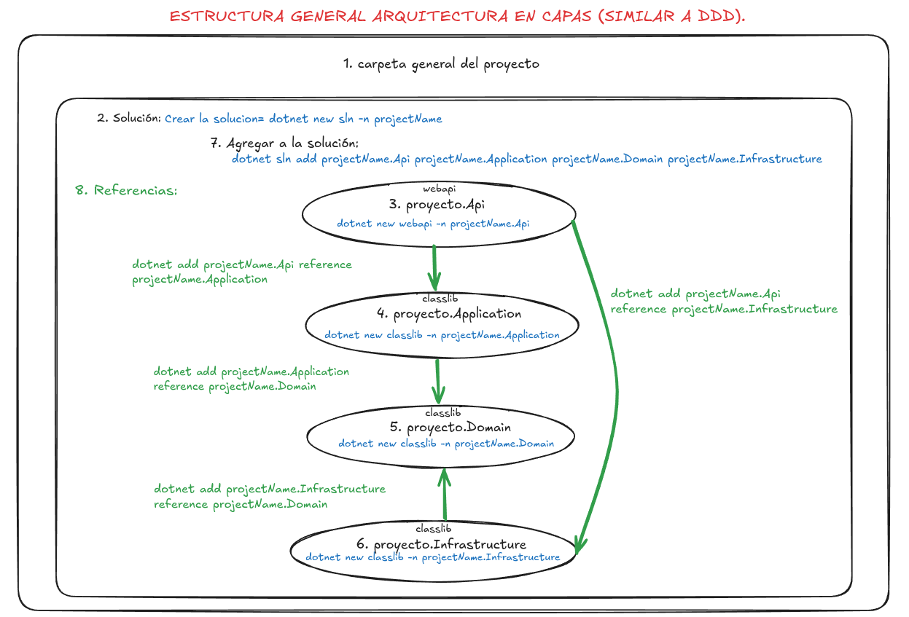

# TEMPLATE FOR JWT AUTHENTICATION

This project was developed in C# .Net with layered 
architecture and philosophy DDD using Entity Framework 
(EF), MySql as database and JWT as authentication method
with Token and Refresh Token.

This is only a template to be used to future projects
that needs similars features. 

## Architecture:
This project was developed with a layered architecture DDD (Domain Driven Design). 
This architectures is very used currently due to manage responsabilities in better way because each layer (project) contains specific logic:

* Domain: Contains Entities, Enums, Interfaces for Repositories.
* Infrastructure: Contains all related with database, for instance Data (AppDbContext), Migrations and Repositories.
* Application: Contanins business logic such as DTO's, Services Interfaces and Services.
* Api: Contains Controllers and the Program file (the orchester).

The way how you must stablish the relationships 
between layers is the following:



### Creating a new project: 
Not recommended, because we can do exactly the same with the script that is further down in the bottom of this document.

#### Creating project's folder:
```
mkdir mySystem
cd mySystem
```

#### Creating the projects inside the folder:
```
dotnet new sln -n mySystem
dotnet new webapi -n mySystem.Api
dotnet new classlib -n mySystem.Application
dotnet new classlib -n mySystem.Domain
dotnet new classlib -n mySystem.Infrastructure
```

#### Add the projects to the solution (sln):
```
dotnet sln add mySystem.Api mySystem.Application mySystem.Domain mySystem.Infrastructure/
```

#### Creating the relationships between projects:
```
dotnet add mySystem.Api reference mySystem.Application/
dotnet add mySystem.Application reference mySystem.Domain/
dotnet add mySystem.Infrastructure/ reference mySystem.Domain/
dotnet add mySystem.Api reference mySystem.Infrastructure/
```

## To start migrations with EF ORM:

By terminal, you need to do the next steps:

```
# Install dotnet EF (if you don't have installed EF):
dotnet tool install --global dotnet-ef

# Command to do a migration:
dotnet ef migrations add InitialCreate --project mySystem.Infrastructure/ --startup-project mySystem.Api/

# Comand to create or update the DB according with the migration:
dotnet ef database update --project mySystem.Infrastructure/ --startup-project mySystem.Api/
```

## Installed packages (Nugets):
Next, you will found the packages (nugets) installed
in each layer. If you wish watch the installed packages in your project, 
you can write the following command at any moment.
```
dotnet list package
```

### Project 'mySystem.Api' has the following package references
```
   [net9.0]: 
   Top-level Package                                          Requested   Resolved
   > AutoMapper                                               12.0.1      12.0.1  
   > AutoMapper.Extensions.Microsoft.DependencyInjection      12.0.1      12.0.1  
   > Microsoft.AspNetCore.Authentication.JwtBearer            9.0.0       9.0.0   
   > Microsoft.EntityFrameworkCore.Design                     9.0.0       9.0.0   
   > Swashbuckle.AspNetCore                                   9.0.0       9.0.0   
   > Swashbuckle.AspNetCore.SwaggerGen                        9.0.0       9.0.0   
   > Swashbuckle.AspNetCore.SwaggerUI                         9.0.0       9.0.0   
```


### Project 'mySystem.Application' has the following package references
```
   [net9.0]: 
   Top-level Package                                          Requested   Resolved                                                                                                                                                                    
   > AutoMapper                                               12.0.1      12.0.1  
   > AutoMapper.Extensions.Microsoft.DependencyInjection      12.0.1      12.0.1  
   > BCrypt.Net-Next                                          4.0.3       4.0.3   
   > Microsoft.Extensions.Configuration                       10.0.1      10.0.1  
   > Microsoft.Extensions.Configuration.Abstractions          10.0.1      10.0.1  
   > System.IdentityModel.Tokens.Jwt                          8.15.0      8.15.0  
```

### Project 'mySystem.Domain' has the following package references
```
   [net9.0]: No packages were found for this framework.
```
   
### Project 'mySystem.Infrastructure' has the following package references      
```
   [net9.0]: 
   Top-level Package                           Requested   Resolved                                                                                                                                                                                   
   > Microsoft.EntityFrameworkCore             9.0.0       9.0.0   
   > Microsoft.EntityFrameworkCore.Design      9.0.0       9.0.0   
   > Pomelo.EntityFrameworkCore.MySql          9.*         9.0.0 

```


## Creatinig projects in a authomatized way:
In case that you don not create your own project manually, you can use this script (only for Linux)
for creating automatically, you only need copy and paste it on your terminal in your desired folder.

```

#!/usr/bin/env bash

echo "========================================="
echo "GENERADOR AUTOMATICO DE PROYECTOS DDD en .NET"
echo "========================================="
echo ""

# Pedir el nombre del proyecto
echo "INGRESA EL NOMBRE DEL PROYECTO: "
read project

if [ -z "$project" ]; then
    echo "ERROR: Debes ingresar un nombre válido."
    exit 1
fi

echo "Detectando SDKs instalados..."
sdks=$(dotnet --list-sdks | awk '{print $1}' | cut -d'.' -f1 | sort -u)

echo "SDKs encontrados: $sdks"
echo ""

# Seleccionar versión
if [ -n "$2" ]; then
    selected=$2
else
    if [ $(echo "$sdks" | wc -w) -eq 1 ]; then
        selected=$sdks
    else
        echo "Elige la versión del SDK a usar:"
        select v in $sdks; do
            selected=$v
            break
        done
    fi
fi

echo ""
echo "USANDO .NET SDK $selected"
echo ""

echo ""
echo "CREANDO SOLUCION Y PROYECTOS PARA: $project"
mkdir "$project"
cd "$project"

dotnet new sln -n "$project"
dotnet new webapi -n "$project.Api"
dotnet new classlib -n "$project.Application"
dotnet new classlib -n "$project.Domain"
dotnet new classlib -n "$project.Infrastructure"

dotnet sln add "$project.Api" "$project.Application" "$project.Domain" "$project.Infrastructure"

dotnet add "$project.Api" reference "$project.Application"
dotnet add "$project.Application" reference "$project.Domain"
dotnet add "$project.Infrastructure" reference "$project.Domain"
dotnet add "$project.Api" reference "$project.Infrastructure"


echo "INSTALANDO PAQUETES NuGet..."
echo "-----------------------------------------"

## EF CORE dinámico
dotnet add "$project.Infrastructure" package Microsoft.EntityFrameworkCore --version "$selected.0.0"
dotnet add "$project.Infrastructure" package Microsoft.EntityFrameworkCore.Design --version "$selected.0.0"
dotnet add "$project.Api" package Microsoft.EntityFrameworkCore.Design --version "$selected.0.0"

## Pomelo (usa tu versión Manual)
dotnet add "$project.Infrastructure" package Pomelo.EntityFrameworkCore.MySql --version "$selected.*"

## Swagger - dinámico
dotnet remove "$project.Api/$project.Api.csproj" package Microsoft.AspNetCore.OpenApi
dotnet add "$project.Api" package Swashbuckle.AspNetCore --version "$selected.0.0"
dotnet add "$project.Api" package Swashbuckle.AspNetCore.SwaggerUI --version "$selected.0.0"
dotnet add "$project.Api" package Swashbuckle.AspNetCore.SwaggerGen --version "$selected.0.0"

## JWT dinámico
dotnet add "$project.Api" package Microsoft.AspNetCore.Authentication.JwtBearer --version "$selected.0.0"

## AutoMapper
dotnet add "$project.Api" package AutoMapper --version 12.0.1
dotnet add "$project.Application" package AutoMapper --version 12.0.1
dotnet add "$project.Api" package AutoMapper.Extensions.Microsoft.DependencyInjection --version 12.0.1
dotnet add "$project.Application" package AutoMapper.Extensions.Microsoft.DependencyInjection --version 12.0.1

## Config / Tokens / Password
dotnet add "$project.Application" package BCrypt.Net-Next
dotnet add "$project.Application" package Microsoft.Extensions.Configuration
dotnet add "$project.Application" package Microsoft.Extensions.Configuration.Abstractions
dotnet add "$project.Application" package System.IdentityModel.Tokens.Jwt


echo "CREANDO ESTRUCTURA DE CARPETAS..."
echo "-----------------------------------------"

mkdir -p "$project.Domain/Entities"
mkdir -p "$project.Domain/Interfaces"
mkdir -p "$project.Infrastructure/Data"
mkdir -p "$project.Infrastructure/Extensions"
mkdir -p "$project.Infrastructure/Repositories"
mkdir -p "$project.Application/DTOs"
mkdir -p "$project.Application/Interfaces"
mkdir -p "$project.Application/Services"
mkdir -p "$project.Api/Controllers"

touch "$project.Domain/Entities/User.cs"
touch "$project.Domain/Interfaces/GeneralRepository.cs"
touch "$project.Infrastructure/Data/AppDbContext.cs"
touch "$project.Infrastructure/Extensions/ServiceCollectionExtensions.cs"
touch "$project.Infrastructure/Repositories/UserRepository.cs"
touch "$project.Application/DTOs/MapProfile.cs"
touch "$project.Application/Interfaces/IUserService.cs"
touch "$project.Application/Services/UserService.cs"
touch "$project.Api/Controllers/UserController.cs"


echo ""
echo "ELIMINANDO ARCHIVOS BASURA..."
rm "$project.Application/Class1.cs"
rm "$project.Domain/Class1.cs"
rm "$project.Infrastructure/Class1.cs"

echo ""
echo "CREANDO .GITIGNORE"
dotnet new gitignore

echo "AGREGANDO EXCLUSIONES PERSONALIZADAS"
touch README.md
echo "appsettings.json" >> .gitignore
echo "./appsettings.json" >> .gitignore
echo "Migrations/" >> .gitignore

echo ""
echo "INICIALIZANDO Git..."
git init
git add .
git branch -M main

echo "========================================="
echo " +++ Proyecto '$project' creado exitosamente."
echo "========================================="

echo ""
echo "PAQUETES INSTALADOS: "
gnome-terminal -- bash -c "dotnet list package; exec bash"

echo ""
echo "Abriendo en Rider..."
rider .

```